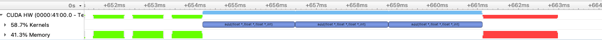
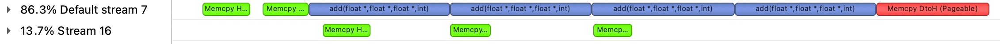
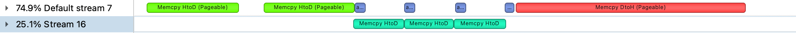

# 1. CUDA 流简介
**CUDA 流表示一个 GPU 操作队列，该队列中的操作将以添加到流中的先后顺序而依次执行。**

可以将一个流看做是 GPU 上的一个任务，不同任务可以并行执行。如果没有指定任何stream，所有的 cuda 操作都在默认的stream上。

我更愿意理解流是更高一个层次的并行手段, 相对于thread, block 和 grid, 它的层级更高, 也更独立。
thread, block 和 grid其实都可以算作 kernel内的并行层次, 而流(stream)是kernel外的并行层次。

用到 CUDA 的程序一般需要处理海量的数据，内存带宽经常会成为主要的瓶颈。在 Stream 的帮助下，CUDA 程序可以有效地将`内存读取`和`数值运算`并行，从而提升数据的吞吐量。使用 CUDA 流，首先要选择一个支持设备重叠（Device Overlap）功能的设备，支持设备重叠功能的 GPU 能够在执行一个 CUDA 核函数的同时，还能在主机和设备之间执行复制数据操作。


支持重叠功能的设备的这一特性很重要，可以在一定程度上提升 GPU 程序的执行效率。一般情况下，CPU 内存远大于 GPU 内存，对于数据量比较大的情况，不可能把 CPU 缓冲区中的数据一次性传输给 GPU，需要分块传输，如果能够在分块传输的同时，GPU 也在执行核函数运算，这样的异步操作，就用到设备的重叠功能，能够提高运算性能。

# 2. 一个简单的 demo
假设有一个模型， 其描述如下：
```python
tmp_1 = vector_add(intput, weigth_0) #intput是输入， weigth_0是权重, tmp_1是 op vector_add 的输出
tmp_2 = vector_add(tmp1, weight_1)
output = vector_add(tmp2, weight_2) #output 是输出
```
模型对应的可视图如下：
```bash
input      weight_0
 \           /
  \         /
  vector_add()   
      |
      |
    tmp_1       weight_1
       \           /
        \         /
        vector_add()
            |
            |
          tmp_2     weight_2
             \          /
              \        /
            vector_add()
                |
                |
              output
```
## 2.1 普通计算方式
一般的方式是提前申请好所需的 GPU 显存，将所有的权重数据提前加载 GPU 中，然后开启计算。 

**注意点1:**

在 GPU 上，我们只需提前申请好输入数据(input_t)， 权重数据（weigth_0,weight_1,weight_2）,以及输出数据（output）所需的显存，而没有申请中间变量（tmp1， tmp2）的显存。这是一种常见的内存复用策略：在计算第一个 vector_add 时，可以把输出直接写入 output 中，计算第二个 vector_add 时， 从 output 中拿数据， 写入 input_t 中， 以此类推，模型的执行流看起来入下图所示。
```bash
input     weight_0
 \           /
  \         /
  vector_add()
      |
      |
    output     weight_1
       \           /
        \         /
        vector_add()
            |
            |
          input_t     weight_2
             \          /
              \        /
            vector_add()
                |
                |
              output
```

**注意点2:**

代码中，我们假设输入数据和所有权重数据大小均为 4 MiB，初始化数据任意指定。同时 kernel 的执行配置也可以任意指定，但是本 demo 中为了让数据拷贝操作和 kernel 计算时间不至于相差太大，kernel 的执行配置线程很少。读者可以更改 kernel 的执行配置，模拟数据拷贝操作和 kernel 执行时间大小关系的不同。
```cpp
// 定义kernel的执行配置
dim3 blockSize(16);
dim3 gridSize(16);
```

**完整的代码可以查看** 

[代码:mian.cu](./code/cuda_stream/)

执行效果如下图所示：

先进行三次 Host 到 GPU 的memcpy(绿色所示)，然后三次 add kernel 计算，最后把GPU上的运算结果拷贝到 CPU（红色所示）



**显存占用**

**input(4 MiB) + weight_0(4 MiB) + weight_1(4 MiB) + weight_2(4 MiB) + output(4 MiB) = 20 MiB**

这也是这种运行该模型方式的最小所需显存。

# 3. 显存优化
试想一下，对于2.1中的模型，如果继续往下不断加深模型，增加 vector_add 算子以及所需的权重，那么要增加多少显存呢？
```md
tmp_1 = vector_add(intput_t, weigth_0)
tmp_2 = vector_add(tmp1, weight_1)
tmp_3 = vector_add(tmp2, weight_2)
output = vector_add(tmp2, weight_3)
...
```

由于中间变量内存复用策略的存在，实际运行增加的显存就是 weight_3 所需的空间。

为了缩减权重数据的显存占用，一个自然的方案就是延迟加载（按需加载），计算某个 Layer 时，需要哪些权重就去加载所需的权重，使用完之后便释放权重。

计算逻辑如下图所示：

```bash
input_t    weight_0
  \           /
   \         /
  vector_add_0()   lod_weight_0(weight_1)
      |               |
      |               |
    output      weight_1
       \           /
        \         /
        vector_add_1()   lod_weight_1(weight_2)
            |              |
            |              |
          input_t      weight_0
             \          /
              \        /
            vector_add_2()   lod_weight_2(weight_3)
                |              |
                |              |
              output        weight_1
                 \            /
                  \          /
                  vector_add_3()
                        |
                        |
                      input
```

**注意点1:**

weight_0 数据可以提前加载，不必等到运行时

**注意点2:**

权重使用完之后释放并不是真正的释放，可以采用类似中间变量内存复用策略那样，加载 weight_2 权重数据时(lod_weight_1(weight_2))，把数据写入原 weight_0 所占的显存中，覆盖原 weight_0 数据, 同理加载 weight_3 权重数据时(lod_weight_2(weight_3))，把数据写入原 weight_1 所占的显存中，覆盖原 weight_1 数据。

这样权重数据使用显存就是：

**weight_0(4 MiB) + weight_1(4 MiB)  = 8 MiB**

相比

**weight_0(4 MiB) + weight_1(4 MiB) + weight_2(4 MiB) + weight_3(4 MiB)  = 16 MiB** 减少了 `50%`

`为什么lod_weight_0(weight_1) 不把数据写入 weight_0中？`

因为第一个 `vector_add_0()   lod_weight_0(weight_1)` 是并发执行， vector_add_0()需要使用 weight_0 中的数据做计算，所以 lod_weight_0(weight_1) 不能写入 weight_0 中。 这样模型运行时，所占空间为：当前所需的 weight 所占空间 + 加载下一层 weight 所占空间。

# 4. 流同步
3 中已经讲述了整体的设计逻辑，下面是代码实现：

**注意cuda流的特性**

```md
流有两种类型:
同步流(空流)
异步流(非空流)

非空流又可以进一步分为以下两种类型：
阻塞流
非阻塞流

**在相同的CUDA上下文中空流与其他所有阻塞流同步执行，使用cudaStreamCreate()函数创建的非空流都是阻塞流，就是说这些流会被空流阻塞**
举例说明：主机创建了2个阻塞流stream1和stream2，主机启动三个核函数，kernel1被stream1启动，kernel2被空流启动，kernel3被stream2启动，启动代码如下。

kernel1<<<1, 1, 0, stream1>>>();
kernel2<<<1, 1>>>();
kernel3<<<1, ,1, 0, stream2>>>();
三个核函数，相对主机而言都是异步执行的，但是相对GPU而言是串行执行的。kernel2必须等到kernel1执行完成之后才能执行，kernel3必须等到kernel2执行完成之后才能执行。（如果去掉kernel2的启动代码，kernel3必须等到kernel1执行完成之后才能执行吗？在设备计算资源足够的情况下，设备不支持Hyper-Q时要等，支持Hyper-Q时kernel1与kernel3可以并发执行）

**空流与非阻塞流异步**
**非空流之间都异步**

利用cudaStreamCreateWithFlags(cudaStream_t *pStream, unsigned int flags)函数可以创建非阻塞流。第二个参数flags有两种选项：
1）cudaStreamDefault，cudaStreamCreate()函数的默认选项
2）cudaStreamNonBlocking，创建非阻塞流。
前面的例子中，如果将stream1和stream2创建为非阻塞流，则三个核函数相对于GPU而言是并发执行的。

阻塞流的更多信息可参考《CUDA_Runtime_API》中的“Stream synchronization behavior”章节。
```
上述有点绕...

总之创建一个非阻塞流，将 Kernel 计算放入一个空流，将数据加载放进另外一个非阻塞流 (load_weight_stream)，然后使用事件让两个流之间某些操作同步。

两个流之间的同步关系如下：
```md
1. vector_add_1() 必须在 lod_weight_0 之后
2. vector_add_2() 必须在 lod_weight_1 之后
3. vector_add_3() 必须在 lod_weight_2 之后
4. lod_weight_1 必须在 vector_add_0() 之后
5. lod_weight_2 必须在 vector_add_1() 之后
```
```cpp
// 执行 kernel 和 数据加载，并做好同步, kernel 在 NULL 流上， 数据加载在 load_weight_stream 流上
add <<< gridSize, blockSize >>>(d_input, d_weight_0, d_output, N);    
cudaEventRecord(pre_compute_event, NULL);

lod_weight(d_weight_1, weight_1, nBytes, load_weight_stream);
cudaEventRecord(load_event, load_weight_stream);

cudaStreamWaitEvent(NULL, load_event);
add <<< gridSize, blockSize >>>(d_output, d_weight_1, d_input, N);
cudaEventRecord(compute_event, NULL);

cudaStreamWaitEvent(load_weight_stream, pre_compute_event);
lod_weight(d_weight_0, weight_2, nBytes, load_weight_stream);
cudaEventRecord(load_event, load_weight_stream);

cudaStreamWaitEvent(NULL, load_event);
add <<< gridSize, blockSize >>>(d_input, d_weight_0, d_output, N);

cudaStreamWaitEvent(load_weight_stream, compute_event);
lod_weight(d_weight_1, weight_3, nBytes, load_weight_stream);
cudaEventRecord(load_event, load_weight_stream);

cudaStreamWaitEvent(NULL, load_event);
add <<< gridSize, blockSize >>>(d_output, d_weight_1, d_input, N);
```

[完整代码](./code/cuda_stream/stream_main.cu)

**至少需要三个 event 来保证同步？**

**如何保证拓扑执行顺序符合预期？**

执行流程如下图所示：



从图中可以看出，在运行前，拷贝输入数据和 weight_0 数据到 GPU， 而 weight_1, weigth_2, weigth_3 数据在运行时加载， 且权重数据进行内存复用。

从执行图可以看出，这种优化策略对速度没有丝毫影响，但权重数据所占显存大幅减少！

# 5. 进一步讨论
4 中的执行图看起来对速度没有影响， 但是如果 kernel 的执行时间比数据加载时间更短呢。

前面提到过可以修改 kernel 的执行配置， 模拟 kernel 的执行时间和数据加载耗时之间的大小关系。
```cpp
// 定义kernel的执行配置
dim3 blockSize(1024);
dim3 gridSize(16);
```

执行图如下所示：


由图可知，当算子的执行时间普遍比权重数据加载耗时更短时，会影响模型的整体耗时。因此这种显存优化方案更适用于模型大 Batch 输入的场景下，此时算子的执行时间可能比权重数据加载耗时更长。

# 6. 总结
1. 权重数据按需加载是一种显存优化的方案，但是可能会影响模型的运行速度，只有在大 Batch 的输入下，权重数据加载速度比算子执行更快，这样就对速度没有影响。

2. 方案的难点： **1.权重变量复用策略； 2. kenel执行流和权重数据加载流之间的同步关系**。

